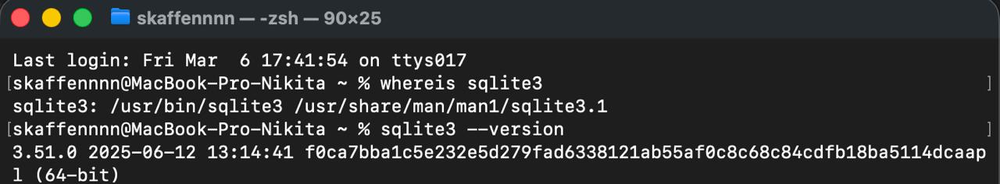
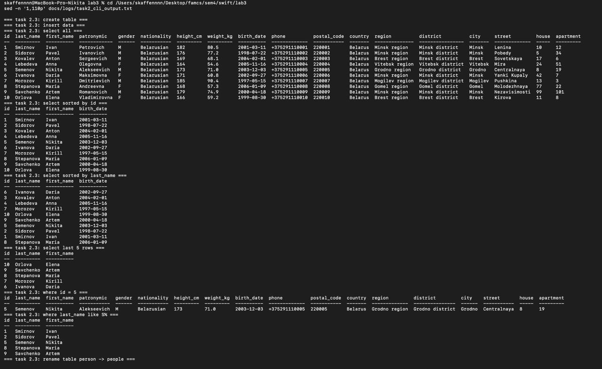
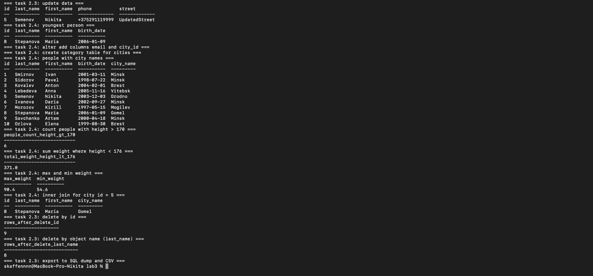
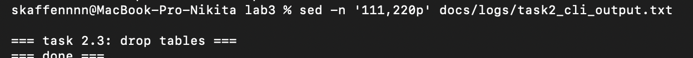

# Лабораторная работа 3

Тема: Проектирование и разработка консольных приложений с хранением данных в SQLite.  
Вариант: 13

## Задание 1. Установка SQLite в macOS

Проверка установки выполнена командами:
- `whereis sqlite3`
- `sqlite3 --version`

Скриншот:
- 

## Задание 2. Управление базой данных из консоли

Использован скрипт: `sql/task2_variant13.sql`.

Выполнены операции упражнения 2.3:
- создание таблицы `person`;
- вставка данных;
- выборки (`SELECT`, сортировки, `LIMIT 5`);
- фильтрация (`WHERE id=5`, `LIKE 'S%'`);
- переименование таблицы `person -> people`;
- обновление записи (`UPDATE`);
- удаление по id и по фамилии;
- экспорт в `.sql` и `.csv`;
- удаление таблиц.

Выполнены запросы упражнения 2.4 (вариант 13):
- самый молодой человек;
- `ALTER TABLE` с добавлением `city_id`;
- создание таблицы `category` для городов;
- `JOIN` для вывода человека и города;
- `COUNT` при `height_cm > 170`;
- `SUM(weight_kg)` при `height_cm < 176`;
- `MAX/MIN(weight_kg)`;
- `INNER JOIN` для города с `id=5`.

Артефакты:
- БД: `data/lab3_task2.db`
- SQL dump: `sql/task2_export.sql`
- CSV: `sql/task2_people.csv`
- лог: `docs/logs/task2_cli_output.txt`

Скриншоты:
- 
- 
- 

## Задание 3. Управление БД в SQLite Database Manager

### Упражнение 3.2 (вариант 13)

Подготовленные SQL-запросы: `sql/task3_variant13_queries.sql`.

Текст запросов:
1. Категория, магазин и сумма для категории `id=5`:
```sql
SELECT c.category_name,
       s.shop_name,
       s.amount
FROM Categories c
JOIN Spendings s ON s.category_id = c.id
WHERE c.id = 5;
```
2. Товар и сумма > 400:
```sql
SELECT g.goods_name,
       gs.amount
FROM Goods g
JOIN Goods_Spendings gs ON gs.goods_id = g.id
WHERE gs.amount > 400;
```

Демо-БД и результаты проверки:
- setup: `sql/task3_demo_setup.sql`
- DB: `data/expenses_demo.db`
- лог: `docs/logs/task3_queries_output.txt`

Результат (фрагмент):
- `Electronics | TechnoMarket | 899.99`
- `Electronics | GadgetCity | 499.5`
- `Smartphone | 1200.0`
- `Headphones | 450.0`
- `Monitor | 600.0`

### Упражнение 3.3

Создана БД по варианту 13 и повторены операции 2.3/2.4 через SQL-скрипты.

## Задание 4. Примеры на C для SQLite

Каталог: `examples/`.

Список примеров:
- `example1_gr12_SkaffennnnNikita.c` - open/create/insert/select;
- `example2_gr12_SkaffennnnNikita.c` - параметризованные запросы;
- `example3_gr12_SkaffennnnNikita.c` - BLOB insert/export;
- `example4_gr12_SkaffennnnNikita.c` - autocommit и transaction;
- `example5_gr12_SkaffennnnNikita.c` - метаданные БД.

Доп. файлы:
- `examples/EXAMPLES.md`
- `examples/Makefile`
- лог сборки и запуска: `docs/logs/task4_examples_build_run.txt`

## Задание 5. Приложение на C для SQLite

Каталог проекта: `project5/`.

Реализовано:
- меню операций;
- `SELECT`, `INSERT`, `DELETE` в коде приложения;
- параметризованные запросы;
- фильтрация:
  - по `id`;
  - по шаблону `last_name LIKE ?`;
  - по общему полю `city`;
- вставки в режиме autocommit и в транзакции;
- хранение фото (BLOB) в таблице `people` и выгрузка в файл.

Структура проекта:
- `project5/include/` - заголовки;
- `project5/src/` - исходники;
- `project5/data/` - БД и файлы;
- `project5/Makefile`.

Логи:
- `docs/logs/task5_build_run.txt`

## Протокол тестирования (задача 5)

| № | Тест | Входные данные | Ожидаемый результат | Фактический результат | Пройден |
|---|------|----------------|---------------------|-----------------------|---------|
| 1 | Инициализация БД | Меню `1` | Таблицы и cities созданы | `Schema and cities ready` | Да |
| 2 | Вставка autocommit | Меню `2` | Добавлена 1 строка | `Inserted 1 row (autocommit)` | Да |
| 3 | Вставка transaction | Меню `3` | Добавлены 3 строки атомарно | `Inserted 3 rows (transaction)` | Да |
| 4 | Поиск по id | Меню `5`, `id=1` | Вывод записи id=1 | Запись выведена | Да |
| 5 | Поиск по шаблону | Меню `6`, `Sm%` | Вывод подходящих фамилий | 2 записи `Smirnov` | Да |
| 6 | Поиск по городу | Меню `7`, `Minsk` | Вывод людей из города | 2 записи из Minsk | Да |
| 7 | BLOB attach/export | Меню `9`,`10` | Фото сохранено и выгружено | `bytes=26`, файл создан | Да |
| 8 | DELETE | Меню `8`, `id=4` | Строка удалена | `Deleted rows: 1` | Да |

## Контрольные вопросы

Ответы будут добавлены после получения формулировок вопросов (в текущем `task.pdf` список вопросов в текстовом извлечении отсутствует).
