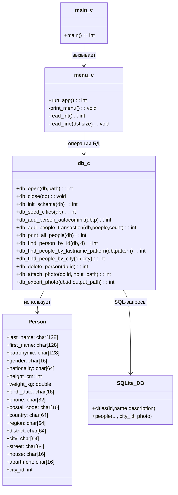
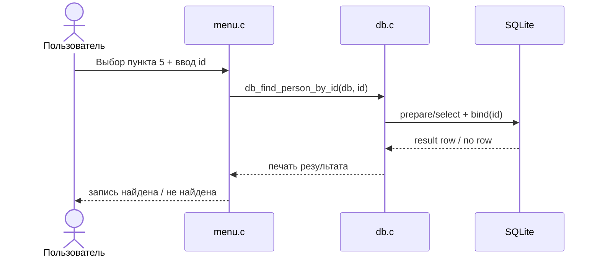
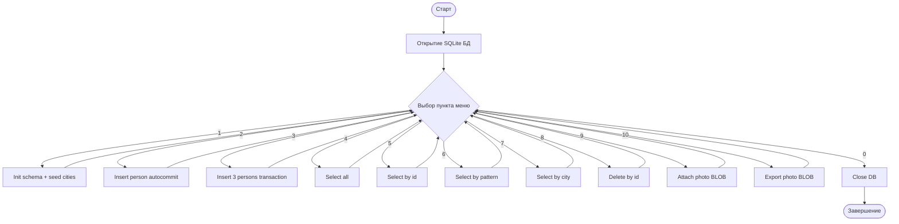

# UML спецификация приложения `project5`

## 1. Назначение
Консольное приложение на C для работы с SQLite БД по сущности «Человек» (вариант 13):
- инициализация схемы БД;
- CRUD-операции с таблицей `people`;
- выборки по `id`, шаблону фамилии и городу;
- демонстрация вставки в режимах autocommit и transaction;
- работа с фотографией (BLOB): запись в БД и выгрузка в файл.

## 2. Диаграмма вариантов использования (Use Case)

```mermaid
flowchart LR
    U[Пользователь]
    APP[Консольное приложение project5]

    U --> UC1[Инициализировать БД]
    U --> UC2[Добавить человека\n(autocommit)]
    U --> UC3[Добавить людей\n(transaction)]
    U --> UC4[Показать всех людей]
    U --> UC5[Поиск по id]
    U --> UC6[Поиск по шаблону фамилии]
    U --> UC7[Поиск по городу]
    U --> UC8[Удалить по id]
    U --> UC9[Прикрепить фото (BLOB)]
    U --> UC10[Экспортировать фото (BLOB)]

    UC1 --> APP
    UC2 --> APP
    UC3 --> APP
    UC4 --> APP
    UC5 --> APP
    UC6 --> APP
    UC7 --> APP
    UC8 --> APP
    UC9 --> APP
    UC10 --> APP
```

## 3. Диаграмма классов/компонентов



## 4. Диаграмма последовательностей (пример: поиск по id)



## 5. Диаграмма активности (общий сценарий)



## 6. Трассировка с кодом
- Интерфейс приложения: `lab3/project5/src/menu.c`
- Точка входа: `lab3/project5/src/main.c`
- Логика доступа к БД: `lab3/project5/src/db.c`
- Модель данных: `lab3/project5/include/person.h`
